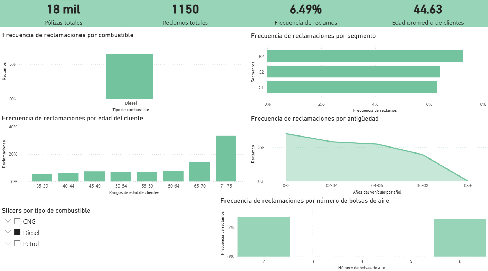

# Dashboard de Análisis de Riesgo en Seguros de Automóviles

## Descripción del proyecto

Este proyecto presenta un análisis de riesgo en seguros de automóviles mediante un dashboard interactivo desarrollado en **Power BI**.

El objetivo es identificar patrones de reclamaciones a partir de variables relacionadas con el cliente, el vehículo y sus características de seguridad. A través de este análisis se exploran posibles factores que influyen en la frecuencia de reclamaciones dentro del portafolio.

## Objetivos

- Analizar la **frecuencia de reclamaciones** del portafolio.
- Identificar diferencias de riesgo por **tipo de combustible**.
- Comparar la frecuencia de reclamaciones entre **segmentos de vehículos**.
- Evaluar la relación entre **edad del cliente** y frecuencia de reclamaciones.
- Analizar el efecto de la **antigüedad del vehículo** sobre el riesgo.
- Explorar si el **número de bolsas de aire** se relaciona con una menor frecuencia de reclamaciones.

## Herramientas utilizadas

- **Power BI** — desarrollo del dashboard interactivo
- **Python (Pandas)** — limpieza y preparación de datos
- **Git y GitHub** — control de versiones y documentación del proyecto

## Métricas principales

- **Pólizas totales:** 59 mil
- **Reclamos totales:** 3748
- **Frecuencia de reclamos:** 6.40%
- **Edad promedio de clientes:** 44.82 años

## Principales hallazgos

- La frecuencia promedio del portafolio es de **6.40%**.
- El segmento **B2** presenta la mayor frecuencia de reclamaciones.
- La frecuencia de reclamaciones aumenta en ciertos grupos de mayor edad.
- Los vehículos con **menor antigüedad** presentan una frecuencia ligeramente mayor.
- El tipo de combustible no parece mostrar diferencias drásticas en la frecuencia de reclamos.
- Los vehículos con más bolsas de aire muestran una frecuencia de reclamaciones ligeramente menor.

## Vista del dashboard



## Estructura del proyecto

```text
claimdatadashboard
│
├── dashboard
│   └── insurance_risk_dashboard.pbix
├── data
│   ├── insurance claims data.csv
│   └── insurance_dashboard_dataset.csv
├── images
│   └── dashboard_preview.png
├── scripts
│   └── actuarial_analysis.py
└── README.md
